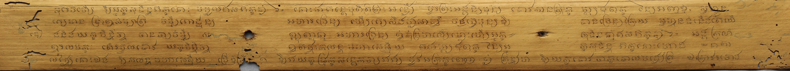
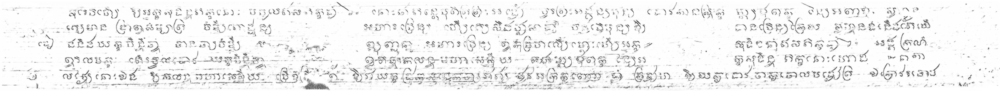

# Manuscript-Binarization
A FCN based architecture is first trained to binarize text documents.The model is then saved and used for initialization for training on the dataset of old palm leaf manuscripts. This is done by fixing the first few layers of the model (learning rate is set to zero for the first few layers), then training this dataset on it.(Transfer Learning)

The results of the final model are shown below-

### Original Palm Leaf Manuscript

### Predicted Probabilty Values

### Using the pretrained model for binarization
1. Make sure you are in the directory `Manuscript-Binarization`
2. To binarize a manuscript page, enter the following command (Replace "imagename" with the name of the image file):

        python classify --model model3_3.model --image imagename
        
*  A window will open which will show the final output.
   
